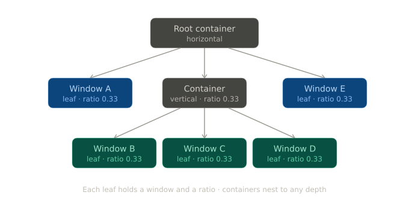
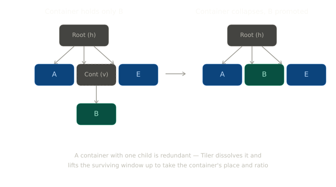
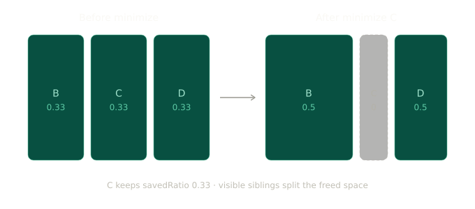
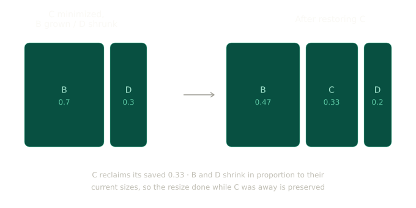

# Tiler — A Tiling Window Manager for GNOME Shell

Tiler is a GNOME Shell extension that turns GNOME into a fully automatic tiling window manager, in the spirit of i3, Sway, and Hyprland — but with first-class support for the things those window managers usually handle poorly: minimizing a window and restoring it to its exact original position and size, maximizing, and floating, all integrated cleanly with GNOME's native behaviour.

Windows are arranged automatically into a non-overlapping grid that fills the screen. You never drag a window to position it or drag its edges to resize it. Open a window and it takes its place in the layout. Close one and the rest expand to fill the gap. Everything is driven by the keyboard, with optional mouse support for resizing and rearranging.

Tiler is built from scratch on GNOME Shell 46+ running on Wayland. The core is a recursive binary space partitioning tree — the same model i3 and Sway use — with a ratio-based sizing system layered on top to handle proportional resizing and clean state restoration.

---

## Video demo

https://github.com/user-attachments/assets/3e7a6e54-513c-48f8-8dea-57b5ccaeb1f8

## Table of contents

- [Why Tiler exists](#why-tiler-exists)
- [Core concepts](#core-concepts)
- [Features](#features)
  - [Automatic tiling](#automatic-tiling)
  - [Splitting and nesting](#splitting-and-nesting)
  - [Minimize and restore](#minimize-and-restore)
  - [Maximize](#maximize)
  - [Floating windows](#floating-windows)
  - [Mouse resizing](#mouse-resizing)
  - [Drag to rearrange](#drag-to-rearrange)
  - [Keyboard navigation](#keyboard-navigation)
  - [Keyboard resize mode](#keyboard-resize-mode)
  - [Window borders](#window-borders)
  - [Workspace isolation](#workspace-isolation)
  - [Animations](#animations)
- [Settings](#settings)
- [Default keybindings](#default-keybindings)
- [Installation](#installation)
- [Updating](#updating)
- [Uninstalling](#uninstalling)
- [Troubleshooting](#troubleshooting)
- [Architecture](#architecture)
- [Contributing](#contributing)

---

## Why Tiler exists

Tiling window managers are loved by people who spend their day in front of a screen because they remove the constant manual labour of arranging windows. But most of them treat minimize, maximize, and float as second-class citizens. In many tiling WMs minimize either doesn't exist or breaks the layout when you bring the window back. Maximize often fights with the tiling logic. Floating windows feel bolted on.

Tiler was built to make those operations feel native. When you minimize a window and restore it later, it returns to exactly the same position at exactly the same size — even if you resized its neighbours while it was gone. Maximize hands the window to GNOME and gets it back cleanly. Floating is a first-class state with its own behaviour and visual treatment. All of this sits on top of a tree model robust enough to never accumulate broken or redundant structure.

---

## Core concepts

Everything in Tiler is built on three ideas.

**The tree.** Each workspace has its own tree. Every window is a *leaf* in that tree. Branches are *containers* that arrange their children either horizontally (side by side) or vertically (stacked). Containers can hold other containers, so the tree nests to any depth. This is how complex layouts are expressed — a horizontal row that contains a vertical column that contains another horizontal row, and so on.



The diagram above shows a real layout: a root horizontal container holding window A on the left, a vertical container in the middle (itself holding windows B, C, and D), and window E on the right.

**Ratios.** Every node carries a ratio representing its share of its parent's space. Three windows side by side each have a ratio around 0.33. If you resize one to take half the width, its ratio becomes 0.5 and its neighbours shrink to fill the rest. Ratios are normalized on the fly during layout calculation, so they never need to sum to exactly one.

**Collapse and restore.** When a window leaves the tiling layer — because it was minimized, maximized, or floated — it is not removed from the tree. Instead its ratio is set to zero and its real ratio is saved. A ratio of zero means the layout engine skips the window entirely and its siblings expand to fill the space. When the window comes back, the saved ratio is restored and the siblings shrink proportionally to make room. This single mechanism powers minimize, maximize, and float, and it is what makes restoration so reliable.

**Container cleanup.** A container that ends up holding only one child serves no purpose. When this happens — for example after the other windows in a nested column are closed — Tiler dissolves the redundant container and promotes the surviving window up to take its place, inheriting its ratio. This propagates upward recursively, so the tree never accumulates dead structure.



---

## Features

### Automatic tiling

Open a window and it is placed into the layout automatically. New windows take half the space of the currently focused window, so opening a window splits the focused one rather than squashing the entire layout equally. Close a window and its siblings grow to reclaim the space. The gap between windows is configurable.

### Splitting and nesting

Before opening a window you can decide whether it should appear beside the focused window or stacked with it:

- The horizontal split shortcut makes the next window open side by side with the focused window.
- The vertical split shortcut makes the next window open above or below it.

If the focused window's container already runs in the chosen direction, the new window joins as a sibling. If not, Tiler creates a new nested container automatically. This is how you build arbitrarily complex layouts using nothing but the keyboard.

### Minimize and restore

Minimizing a window collapses it out of the tiling layer using the ratio-zero mechanism. Its siblings expand to fill the freed space. The window keeps its position in the tree and a saved copy of its ratio.



When you restore it, Tiler writes the saved ratio back and scales the currently visible siblings down proportionally to make room. The important detail is *proportionally to their current sizes* — if you resized any of those siblings while the window was minimized, those changes are respected. The restored window always lands in a valid, natural-looking layout regardless of what happened while it was away.



In the diagram above, window C was minimized, then B was grown and D shrunk. On restore, C reclaims its saved ratio while B and D give up space in proportion to their current sizes — so the resizing done while C was away is preserved.

### Maximize

Maximizing collapses the window out of the tiling layer and hands it to GNOME, which maximizes it natively. The remaining tiled windows reorganize to use the full screen. When you restore the window it drops straight back into its original position with its original ratio.

Windows that launch already maximized — common with some file managers and dialogs — are detected and watched. The moment they are unmaximized they join the tiling layer at the correct position.

### Floating windows

Floating is a first-class state. Toggling float on a tiled window removes it from the tiling layer, centers it on screen at a configurable size, and lets you move and resize it freely without affecting any tiled window. Toggling float off slides it back into its original tiled position with its saved ratio, animated smoothly.

Floating a window that is currently maximized works too — Tiler unmaximizes it first, suppresses GNOME's built-in restore animation, and animates the window cleanly to the center instead of showing a jarring two-step transition.

### Mouse resizing

Although Tiler is keyboard-driven, full mouse resizing is supported. Drag any window edge or corner and the neighbouring windows resize in real time as you drag. Corner drags resize both axes at once, with each axis finding its own boundary in the tree. The final proportions are committed when you release the mouse.

### Drag to rearrange

Drag a tiled window over another tiled window to rearrange the layout. Two modes are available:

- **Insert mode** drops the window into a specific position. A highlight shows where it will land — dropping on the left, right, top, or bottom 30 percent of the target inserts the window before, after, above, or below it, creating a nested container if needed.
- **Swap mode** exchanges the two windows' positions in the tree, leaving the structure and all ratios unchanged.

A shortcut toggles between the two modes. If you drag a window but don't drop it on another window, it animates back to its tiled position.

### Keyboard navigation

Move focus between tiled windows using vim-style directional keys. The navigation algorithm finds the window that shares the most edge with the current window in the chosen direction, so focus moves predictably even in complex nested layouts.

### Keyboard resize mode

Press the resize-mode shortcut and a red indicator appears around the active window. While in resize mode, directional keys grow the window from any edge, and the same keys with an extra modifier shrink it. Each press moves the edge by a configurable pixel step.

The resize logic walks up the tree to find the correct neighbour to trade space with, so it works correctly even when the neighbour lives in a different container several levels up. Floating windows resize freely in this mode without disturbing anything else. Press the shortcut again to leave resize mode.

### Window borders

Every window gets a colored border indicating its state at a glance:

- The focused window gets a distinct accent border.
- Unfocused tiled windows get a subtle border.
- Floating windows get their own color.
- Maximized windows get no border.

Border width, corner radius, and all colors are configurable, and changes apply live without restarting.

### Workspace isolation

Each workspace owns a completely independent tree. Tiling, minimizing, resizing, and rearranging on one workspace have no effect on any other. Moving a window to another workspace reorganizes both the source and the destination. Dynamic workspaces are fully supported — when GNOME removes an empty workspace, all higher workspace indices shift down automatically so nothing breaks.

### Animations

Layout changes are animated. When windows reorganize — because one was added, removed, restored, or moved — every affected window animates smoothly to its new position simultaneously. New windows are positioned before they first render, so they appear directly in place instead of flashing at the screen center first.

---

## Settings

Tiler ships with a full GNOME preferences panel, organized into three tabs. Open it with:

```bash
gnome-extensions prefs tiler@abdulmateenzwl
```

Or click the settings icon next to Tiler in the GNOME Extensions app.

**Appearance** controls border width, border corner radius, the border colors for focused, tiled, and floating windows, and the gap between windows.

**Behaviour** controls the default width and height for floating windows, and the pixel step used for each keypress in keyboard resize mode (horizontal and vertical separately).

**Keybindings** lets you remap every shortcut. Click the edit icon next to a shortcut, press the new key combination, and it saves automatically. Each shortcut also has a button to clear it and a button to reset it to its default.

All settings apply live — there is no need to disable and re-enable the extension after changing them.

---

## Default keybindings

Every shortcut below can be changed in the Keybindings tab.

| Shortcut | Action |
|---|---|
| `Super` + `H` / `J` / `K` / `L` | Focus the window to the left / below / above / right |
| `Super` + `Shift` + `H` | Set the next window to split horizontally |
| `Super` + `Shift` + `V` | Set the next window to split vertically |
| `Super` + `F` | Toggle floating for the focused window |
| `Super` + `Enter` | Enter or leave keyboard resize mode |
| `Super` + `Shift` + `H` / `J` / `K` / `L` | In resize mode: grow the window from that edge |
| `Super` + `Shift` + `Alt` + `H` / `J` / `K` / `L` | In resize mode: shrink the window from that edge |
| `Super` + `Alt` + `T` | Retile all windows on the current workspace |
| `Super` + `Shift` + `C` | Set drag mode to swap |
| `Super` + `Shift` + `X` | Set drag mode to insert |

---

## Installation

### Requirements

- GNOME Shell 46, 47, 48, 49, or 50
- A Wayland session (X11 is not supported)
- `glib-compile-schemas`, which ships with the `libglib2.0-dev` package on Debian and Ubuntu, and `glib2-devel` on Fedora

You can check your GNOME Shell version with:

```bash
gnome-shell --version
```

### Install from GitHub

Clone the repository directly into the GNOME extensions directory, using the extension's UUID as the folder name:

```bash
git clone https://github.com/abdulmateenzwl/tiler.git \
  ~/.local/share/gnome-shell/extensions/tiler@abdulmateenzwl
```

Compile the settings schema so the preferences and keybindings work:

```bash
glib-compile-schemas \
  ~/.local/share/gnome-shell/extensions/tiler@abdulmateenzwl/schemas/
```

Log out and log back in. This step is required on Wayland — GNOME Shell cannot reload extensions in place, so the new extension only becomes available after a fresh session starts.

Enable the extension:

```bash
gnome-extensions enable tiler@abdulmateenzwl
```

### Verify it is running

```bash
gnome-extensions info tiler@abdulmateenzwl
```

You should see `State: ENABLED`. If you see `State: ERROR`, see the Troubleshooting section.

---

## Updating

Pull the latest changes, recompile the schema in case it changed, and restart your session:

```bash
cd ~/.local/share/gnome-shell/extensions/tiler@abdulmateenzwl
git pull

glib-compile-schemas schemas/
```

Then log out and back in. Any time you change extension files or recompile the schema on Wayland, you must start a fresh session for the changes to take effect.

---

## Uninstalling

Disable the extension and remove its folder:

```bash
gnome-extensions disable tiler@abdulmateenzwl
rm -rf ~/.local/share/gnome-shell/extensions/tiler@abdulmateenzwl
```

Log out and back in to fully unload it.

---

## Troubleshooting

**The extension does not appear after installing.** The most common causes are a forgotten session restart or an uncompiled schema. Make sure you logged out and back in after cloning, and that you ran `glib-compile-schemas` against the `schemas/` folder inside the extension directory. Confirm the folder name exactly matches the UUID `tiler@abdulmateenzwl`.

**The extension shows `State: ERROR`.** Watch the logs while reproducing the problem:

```bash
journalctl /usr/bin/gnome-shell -f | grep -i tiler
```

The error and stack trace there will point to the cause. A schema that was not recompiled is the most frequent culprit.

**Keybindings do nothing.** This almost always means the schema was not compiled after install or update. Recompile it and restart your session. Also check the Keybindings tab in case a shortcut conflicts with an existing GNOME binding.

**Settings changes do not take effect.** Settings apply live, so if they don't, the schema is likely stale. Recompile it and restart the session.

---

## Architecture

Tiler is split into focused modules, each with a single responsibility.

| File | Responsibility |
|---|---|
| `extension.js` | Entry point. Instantiates and wires together every module, and connects the tracker's events to the border manager. |
| `containerTree.js` | The pure tree data model. Insert, remove, collapse, restore, swap, and relative-insert operations. No GNOME dependencies. |
| `layoutEngine.js` | A pure function that takes a tree node and a rectangle and returns pixel positions for every visible window. No side effects. |
| `windowTracker.js` | Owns all GNOME signal connections. Manages window lifecycle and state transitions, and emits high-level events like window added, removed, maximized, and floating. |
| `tileManager.js` | Applies calculated layouts to real windows. Handles live mouse resize, drag tracking, focus raising, and animations. |
| `borderManager.js` | Creates and maintains the per-window border overlays, including stacking, workspace-aware visibility, and live color updates. |
| `resizeManager.js` | Implements keyboard resize mode — the indicator, directional resizing across containers, and floating-window resizing. |
| `keybindings.js` | Registers and unregisters all keyboard shortcuts. |
| `prefs.js` | Builds the GNOME preferences window with its three tabs. |

The design keeps a strict separation between pure logic and GNOME integration. All tree mutations live in `containerTree.js`. The layout engine is a pure function that can be tested with plain JavaScript objects as stand-in windows, with no GNOME Shell running. The tracker is the only module that touches GNOME signals, and it translates low-level signals into clean high-level events that the other modules consume.

---

## Contributing

Contributions are welcome.

### Development setup

Clone into the extensions directory, compile the schema, and enable:

```bash
git clone https://github.com/abdulmateenzwl/tiler.git \
  ~/.local/share/gnome-shell/extensions/tiler@abdulmateenzwl

glib-compile-schemas \
  ~/.local/share/gnome-shell/extensions/tiler@abdulmateenzwl/schemas/

gnome-extensions enable tiler@abdulmateenzwl
```

Log out and back in to load it. After each code change, log out and back in again — Wayland does not allow in-place reloads.

### Viewing logs

```bash
journalctl /usr/bin/gnome-shell -f | grep Tiler
```

### Testing the tree in isolation

Because the tree and layout engine are pure, they can be run outside GNOME Shell with GJS:

```bash
gjs -m ~/.local/share/gnome-shell/extensions/tiler@abdulmateenzwl/test-tree.js
```

### Guidelines

- Keep all tree mutations inside `containerTree.js`.
- Keep `layoutEngine.js` a pure function with no side effects and no global access.
- Every GNOME signal you connect must be stored and disconnected in the relevant `disable()` path.
- After any change to tree logic, manually test maximize, minimize, float, and moving a window between workspaces — these are the operations most likely to expose edge cases.

### Reporting issues

When opening an issue, please include your GNOME Shell version, the relevant output from `journalctl /usr/bin/gnome-shell | grep Tiler`, and clear steps to reproduce the problem.

---

## Roadmap

- When a tiled window closes, move focus to the most recently used tiled window rather than GNOME's default order.
- Multi-monitor support with an independent tree per monitor.
- Layout presets for quickly switching between common arrangements.
- Window rules to always float or always tile specific applications by their window class.
- A scratchpad workspace for stashing and recalling windows with a shortcut.
